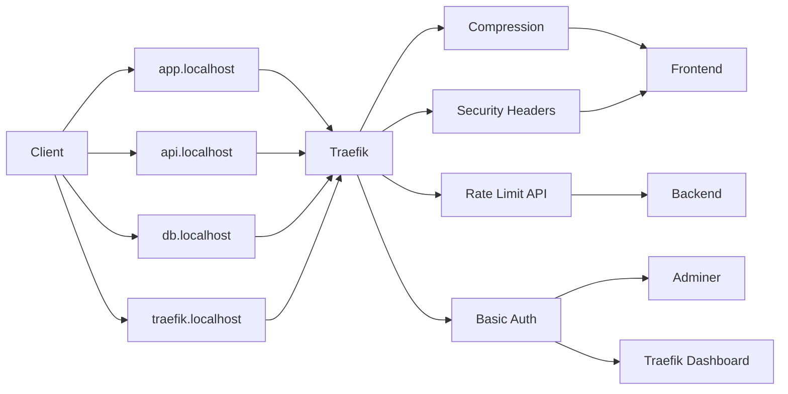

```mermaid
flowchart LR
    U[Client]

    U --> A[app.localhost]
    U --> B[api.localhost]
    U --> C[db.localhost]
    U --> D[traefik.localhost]

    A --> T[Traefik]
    B --> T
    C --> T
    D --> T

    T --> M1[Compression]
    T --> M2[Security Headers]
    T --> M3[Rate Limit API]
    T --> M4[Basic Auth]

    M1 --> F[Frontend]
    M2 --> F

    M3 --> G[Backend]

    M4 --> H[Adminer]
    M4 --> I[Traefik Dashboard]
```
