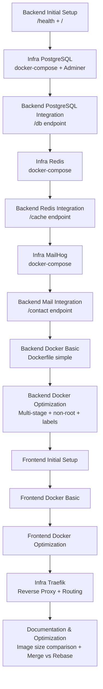

## Plan

```mermaid
flowchart TD

    A[Backend Initial Setup<br/>/health + /] --> B[Infra PostgreSQL<br/>docker-compose + Adminer]
    B --> C[Backend PostgreSQL Integration<br/>/db endpoint]

    C --> D[Infra Redis<br/>docker-compose]
    D --> E[Backend Redis Integration<br/>/cache endpoint]

    E --> F[Infra MailHog<br/>docker-compose]
    F --> G[Backend Mail Integration<br/>/contact endpoint]

    G --> H[Backend Docker Basic<br/>Dockerfile simple]
    H --> I[Backend Docker Optimization<br/>Multi-stage + non-root + labels]

    I --> J[Frontend Initial Setup]
    J --> K[Frontend Docker Basic]
    K --> L[Frontend Docker Optimization]

    L --> M[Infra Traefik<br/>Reverse Proxy + Routing]

    M --> N[Documentation & Optimization<br/>Image size comparison + Merge vs Rebase]

```
