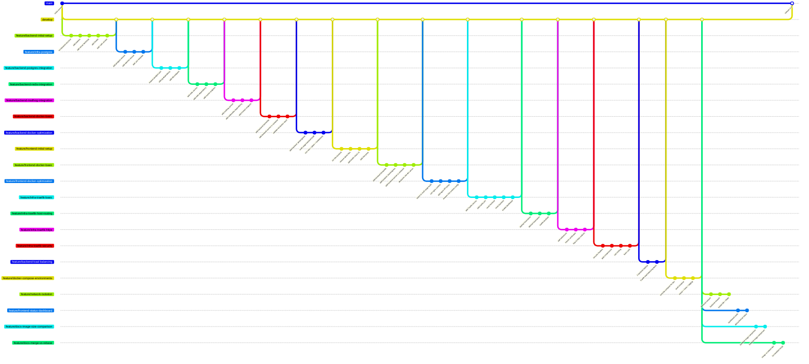

## 🗺️ Roadmap détaillée

```mermaid
gitGraph LR:
   commit id: "initial commit"

   branch develop
   checkout develop

   branch feature/backend-initial-setup
   checkout feature/backend-initial-setup
   commit id: "init backend structure"
   commit id: "add express"
   commit id: "add server bootstrap"
   commit id: "add /health"
   commit id: "add / with version"
   checkout develop
   merge feature/backend-initial-setup

   branch feature/infra-postgres
   checkout feature/infra-postgres
   commit id: "add postgres service"
   commit id: "add adminer service"
   commit id: "add .env template"
   checkout develop
   merge feature/infra-postgres

   branch feature/backend-postgres-integration
   checkout feature/backend-postgres-integration
   commit id: "expose postgres port"
   commit id: "add pg dependency"
   commit id: "add /db endpoint"
   checkout develop
   merge feature/backend-postgres-integration

   branch feature/backend-redis-integration
   checkout feature/backend-redis-integration
   commit id: "add redis service"
   commit id: "add redis dependency"
   commit id: "add /cache endpoint"
   checkout develop
   merge feature/backend-redis-integration

   branch feature/backend-mailhog-integration
   checkout feature/backend-mailhog-integration
   commit id: "add mailhog service"
   commit id: "add nodemailer dependency"
   commit id: "add /contact endpoint"
   checkout develop
   merge feature/backend-mailhog-integration

   branch feature/backend-docker-basic
   checkout feature/backend-docker-basic
   commit id: "add backend Dockerfile"
   commit id: "add backend service in compose"
   commit id: "validate full docker stack"
   checkout develop
   merge feature/backend-docker-basic

   branch feature/backend-docker-optimization
   checkout feature/backend-docker-optimization
   commit id: "add backend .dockerignore"
   commit id: "multi-stage backend build"
   commit id: "non-root + labels + healthcheck"
   checkout develop
   merge feature/backend-docker-optimization

   branch feature/frontend-initial-setup
   checkout feature/frontend-initial-setup
   commit id: "init Vite frontend"
   commit id: "remove demo files"
   commit id: "add health check UI"
   commit id: "add Vite proxy"
   checkout develop
   merge feature/frontend-initial-setup

   branch feature/frontend-docker-basic
   checkout feature/frontend-docker-basic
   commit id: "add frontend Dockerfile"
   commit id: "add frontend .dockerignore"
   commit id: "add frontend service in compose"
   commit id: "dockerize Vite dev server"
   checkout develop
   merge feature/frontend-docker-basic

   branch feature/frontend-docker-optimization
   checkout feature/frontend-docker-optimization
   commit id: "switch to multi-stage build"
   commit id: "use nginx runtime"
   commit id: "add nginx API proxy"
   commit id: "remove Vite runtime config"
   checkout develop
   merge feature/frontend-docker-optimization

   branch feature/infra-traefik-basic
   checkout feature/infra-traefik-basic
   commit id: "add Traefik service"
   commit id: "add traefik.yml"
   commit id: "route frontend"
   commit id: "route backend"
   commit id: "enable dashboard"
   checkout develop
   merge feature/infra-traefik-basic

   branch feature/infra-traefik-host-routing
   checkout feature/infra-traefik-host-routing
   commit id: "app/api hostnames"
   commit id: "db/mail hostnames"
   commit id: "traefik.localhost"
   checkout develop
   merge feature/infra-traefik-host-routing

   branch feature/infra-traefik-https
   checkout feature/infra-traefik-https
   commit id: "add websecure"
   commit id: "mkcert certificates"
   commit id: "http to https redirect"
   checkout develop
   merge feature/infra-traefik-https

   branch feature/infra-traefik-security
   checkout feature/infra-traefik-security
   commit id: "security headers"
   commit id: "gzip compression"
   commit id: "rate limiting"
   commit id: "basic auth"
   checkout develop
   merge feature/infra-traefik-security

   branch feature/backend-load-balancing
   checkout feature/backend-load-balancing
   commit id: "2 backend replicas"
   commit id: "Traefik load balancing demo"
   checkout develop
   merge feature/backend-load-balancing

   branch feature/docker-compose-environments
   checkout feature/docker-compose-environments
   commit id: "override compose for dev"
   commit id: "prod compose"
   commit id: "restart + limits + logging"
   checkout develop
   merge feature/docker-compose-environments

   branch feature/network-isolation
   checkout feature/network-isolation
   commit id: "frontend network"
   commit id: "backend network"
   commit id: "isolate DB + Redis"

   checkout develop
   branch feature/frontend-status-dashboard
   checkout feature/frontend-status-dashboard
   commit id: "dashboard cards"
   commit id: "db/cache/mail status"

   checkout develop
   branch feature/docs-image-size-comparison
   checkout feature/docs-image-size-comparison
   commit id: "backend image comparison"
   commit id: "frontend image comparison"

   checkout develop
   branch feature/docs-merge-vs-rebase
   checkout feature/docs-merge-vs-rebase
   commit id: "merge vs rebase doc"
   commit id: "Git workflow recap"

   checkout main
   merge develop id: "release v1.0"
```
