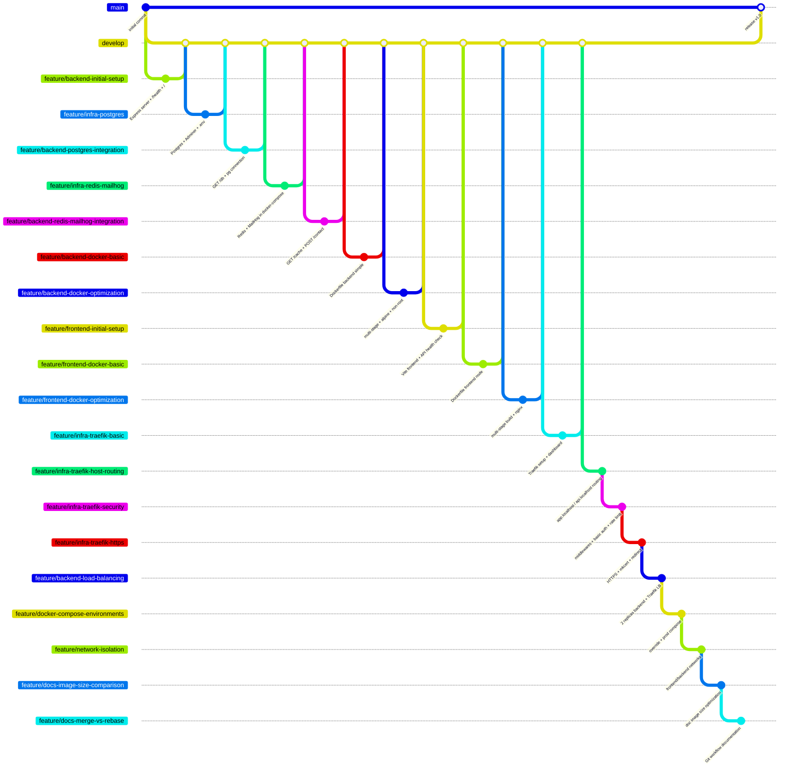

## 🗺️ Roadmap

```mermaid
gitGraph LR:
   commit id: "initial commit"

   branch develop
   checkout develop

   branch feature/backend-initial-setup
   checkout feature/backend-initial-setup
   commit id: "Express server + /health + /"
   checkout develop
   merge feature/backend-initial-setup

   branch feature/infra-postgres
   checkout feature/infra-postgres
   commit id: "Postgres + Adminer + .env"
   checkout develop
   merge feature/infra-postgres

   branch feature/backend-postgres-integration
   checkout feature/backend-postgres-integration
   commit id: "GET /db + pg connection"
   checkout develop
   merge feature/backend-postgres-integration

   branch feature/infra-redis-mailhog
   checkout feature/infra-redis-mailhog
   commit id: "Redis + MailHog in docker-compose"
   checkout develop
   merge feature/infra-redis-mailhog

   branch feature/backend-redis-mailhog-integration
   checkout feature/backend-redis-mailhog-integration
   commit id: "GET /cache + POST /contact"
   checkout develop
   merge feature/backend-redis-mailhog-integration

   branch feature/backend-docker-basic
   checkout feature/backend-docker-basic
   commit id: "Dockerfile backend simple"
   checkout develop
   merge feature/backend-docker-basic

   branch feature/backend-docker-optimization
   checkout feature/backend-docker-optimization
   commit id: "multi-stage + alpine + non-root"
   checkout develop
   merge feature/backend-docker-optimization

   branch feature/frontend-initial-setup
   checkout feature/frontend-initial-setup
   commit id: "Vite frontend + API health check"
   checkout develop
   merge feature/frontend-initial-setup

   branch feature/frontend-docker-basic
   checkout feature/frontend-docker-basic
   commit id: "Dockerfile frontend node"
   checkout develop
   merge feature/frontend-docker-basic

   branch feature/frontend-docker-optimization
   checkout feature/frontend-docker-optimization
   commit id: "multi-stage build + nginx"
   checkout develop
   merge feature/frontend-docker-optimization

   branch feature/infra-traefik-basic
   checkout feature/infra-traefik-basic
   commit id: "Traefik setup + dashboard"
   checkout develop
   merge feature/infra-traefik-basic

   branch feature/infra-traefik-host-routing
   checkout feature/infra-traefik-host-routing
   commit id: "app.localhost / api.localhost routing"

   branch feature/infra-traefik-security
   checkout feature/infra-traefik-security
   commit id: "middlewares + basic auth + rate limit"

   branch feature/infra-traefik-https
   checkout feature/infra-traefik-https
   commit id: "HTTPS + mkcert + redirect"

   branch feature/backend-load-balancing
   checkout feature/backend-load-balancing
   commit id: "2 replicas backend + Traefik LB"

   branch feature/docker-compose-environments
   checkout feature/docker-compose-environments
   commit id: "override + prod compose"

   branch feature/network-isolation
   checkout feature/network-isolation
   commit id: "frontend/backend networks"

   branch feature/docs-image-size-comparison
   checkout feature/docs-image-size-comparison
   commit id: "doc image size optimization"

   branch feature/docs-merge-vs-rebase
   checkout feature/docs-merge-vs-rebase
   commit id: "Git workflow documentation"

   checkout main
   merge develop id: "release v1.0"
```
