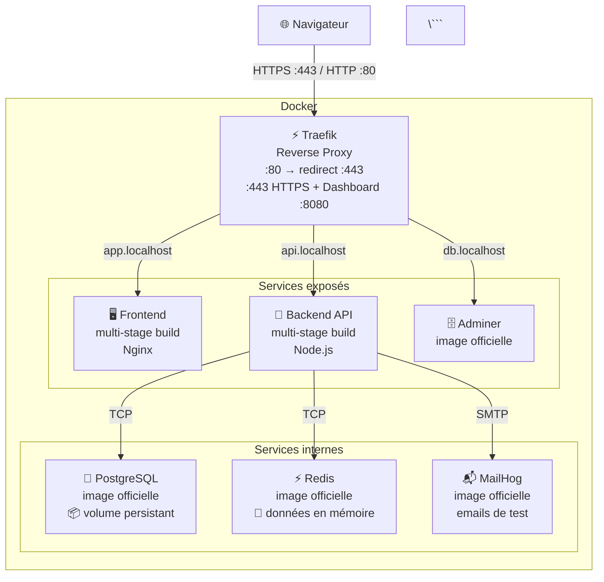

## Architecture

```mermaid
graph TD
    Browser["🌐 Navigateur"]

    Browser -->|"HTTPS :443 / HTTP :80"| Traefik

    subgraph Docker
        Traefik["⚡ Traefik<br/>Reverse Proxy<br/>:80 → redirect :443<br/>:443 HTTPS + Dashboard :8080"]

        Traefik -->|"app.localhost"| Frontend
        Traefik -->|"api.localhost"| Backend
        Traefik -->|"db.localhost"| Adminer

        subgraph "Services exposés"
            Frontend["🖥️ Frontend<br/>multi-stage build<br/>Nginx"]
            Backend["🔧 Backend API<br/>multi-stage build<br/>Node.js"]
            Adminer["🗄️ Adminer<br/>image officielle"]
        end

        subgraph "Services internes"
            PostgreSQL["🐘 PostgreSQL<br/>image officielle<br/>📦 volume persistant"]
            Redis["⚡ Redis<br/>image officielle<br/>💾 données en mémoire"]
            MailHog["📬 MailHog<br/>image officielle<br/>emails de test"]
        end

        Backend -->|"TCP"| PostgreSQL
        Backend -->|"TCP"| Redis
        Backend -->|"SMTP"| MailHog
    end
\```
```
