# Architecture Réseau

## 1. Schéma général

```mermaid
graph TD
    Client([🌐 Client])

    subgraph Traefik
        EP80[Entrypoint :80<br/>web]
        EP443[Entrypoint :443<br/>websecure]
        
        subgraph Middlewares
            REDIRECT[https-redirect<br/>HTTP → HTTPS 301]
            SECURITY[security-headers<br/>X-Frame, HSTS, XSS...]
            GZIP[gzip-compress<br/>Compression brotli/gzip]
            RATE[rate-limit<br/>100 req/min]
        end
    end

    subgraph Services
        FRONTEND[🖥️ Frontend<br/>app.localhost]
        BACKEND[⚙️ Backend<br/>api.localhost]
        ADMINER[🗄️ Adminer<br/>db.localhost]
        MAILHOG[📧 MailHog<br/>mail.localhost]
        DASHBOARD[📊 Dashboard<br/>traefik.localhost]
    end

    Client -->|HTTP :80| EP80
    EP80 --> REDIRECT
    REDIRECT -->|301 HTTPS| Client

    Client -->|HTTPS :443| EP443
    EP443 --> SECURITY
    SECURITY --> GZIP

    GZIP -->|app.localhost| FRONTEND
    GZIP --> RATE
    RATE -->|api.localhost| BACKEND

    EP443 -->|db.localhost| ADMINER
    EP443 -->|mail.localhost| MAILHOG
    EP443 -->|traefik.localhost| DASHBOARD
```




---

## 2. Isolation réseau

Le projet utilise deux réseaux Docker distincts pour isoler les services :

### Réseau `frontend`
Contient les services exposés publiquement via Traefik :
- **Traefik** : point d'entrée unique pour tout le trafic entrant
- **Frontend** : serveur nginx qui sert les fichiers statiques

### Réseau `backend`
Contient les services internes, inaccessibles directement depuis l'extérieur :
- **Backend** (x2) : API Node.js
- **PostgreSQL** : base de données relationnelle
- **Redis** : cache et compteur de visites
- **MailHog** : serveur SMTP de développement
- **Adminer** : interface d'administration PostgreSQL

### Traefik : pont entre les deux réseaux
Traefik est le seul service présent sur les **deux réseaux**. Il reçoit le trafic externe sur le réseau `frontend` et le route vers les services appropriés sur le réseau `backend`. La base de données n'est **jamais** accessible depuis le réseau `frontend`.

---

## 3. Fonctionnement de Traefik

Traefik s'articule autour de quatre concepts clés :

### Providers
Le provider **Docker** permet à Traefik de découvrir automatiquement les services via les labels des conteneurs. Le provider **File** charge la configuration statique des middlewares et certificats TLS depuis `traefik/dynamic/`.

```yaml
# traefik.yml
providers:
  docker:
    exposedByDefault: false   # Seuls les conteneurs avec traefik.enable=true sont exposés
  file:
    directory: /dynamic
    watch: true               # Rechargement automatique à chaque modification
```

### Entrypoints
Deux points d'entrée sont définis :
- **web** (`:80`) : reçoit le trafic HTTP et le redirige immédiatement vers HTTPS
- **websecure** (`:443`) : reçoit le trafic HTTPS avec les certificats mkcert

### Routers
Chaque service expose deux routers via ses labels Docker :
- Un router HTTP qui applique le middleware `https-redirect`
- Un router HTTPS qui applique les middlewares de sécurité

```yaml
# Exemple pour le backend
- "traefik.http.routers.backend.rule=Host(`api.localhost`)"
- "traefik.http.routers.backend.entrypoints=web"
- "traefik.http.routers.backend.middlewares=https-redirect@file"
- "traefik.http.routers.backend-secure.rule=Host(`api.localhost`)"
- "traefik.http.routers.backend-secure.entrypoints=websecure"
- "traefik.http.routers.backend-secure.middlewares=security-headers@file,gzip-compress@file,rate-limit@file"
```

### Services
Traefik crée automatiquement un service pour chaque conteneur et gère le **load balancing** entre les replicas. Avec `--scale backend=2`, Traefik distribue le trafic entre les deux instances du backend en round-robin.

### Middlewares
Les middlewares sont définis dans `traefik/dynamic/middlewares.yml` et appliqués via les labels :

| Middleware | Appliqué sur | Rôle |
|---|---|---|
| `https-redirect` | Tous (HTTP) | Redirection 301 vers HTTPS |
| `security-headers` | Frontend + Backend | HSTS, X-Frame-Options, CSP... |
| `gzip-compress` | Frontend + Backend | Compression des réponses |
| `rate-limit` | Backend uniquement | 100 req/min, burst 50 |
| `basic-auth` | Traefik + Adminer | Authentification HTTP Basic |

---

## 4. Justification des choix de sécurité

### HTTPS obligatoire
Tout le trafic HTTP est redirigé vers HTTPS via le middleware `https-redirect`. Les certificats sont générés avec mkcert pour le développement local, garantissant un comportement identique à la production.

### Headers de sécurité
Les headers HTTP de sécurité protègent contre les attaques courantes :
- **HSTS** (`Strict-Transport-Security`) : force le navigateur à utiliser HTTPS
- **X-Frame-Options** (`frameDeny`) : protège contre le clickjacking
- **X-Content-Type-Options** (`nosniff`) : empêche le MIME sniffing
- **Referrer-Policy** : limite les informations envoyées aux sites tiers
- **Permissions-Policy** : désactive les APIs sensibles (caméra, micro, géolocalisation)

### Rate limiting sur l'API
Le rate limiting (100 req/min, burst 50) est appliqué uniquement sur le backend pour protéger l'API contre les abus et les attaques par force brute. Le frontend n'en a pas besoin car il sert des fichiers statiques.

### Basic Auth sur les interfaces d'administration
Le dashboard Traefik et Adminer sont protégés par une authentification HTTP Basic. Ces interfaces exposent des informations sensibles sur l'infrastructure et ne doivent pas être accessibles publiquement.

### Isolation réseau
La base de données PostgreSQL et Redis ne sont accessibles que depuis le réseau `backend`. Même si le frontend était compromis, il ne pourrait pas atteindre directement la base de données.

### Utilisateur non-root
Les conteneurs backend et frontend tournent avec un utilisateur dédié (`appuser`, UID 1001) pour limiter l'impact d'une éventuelle compromission du conteneur.
