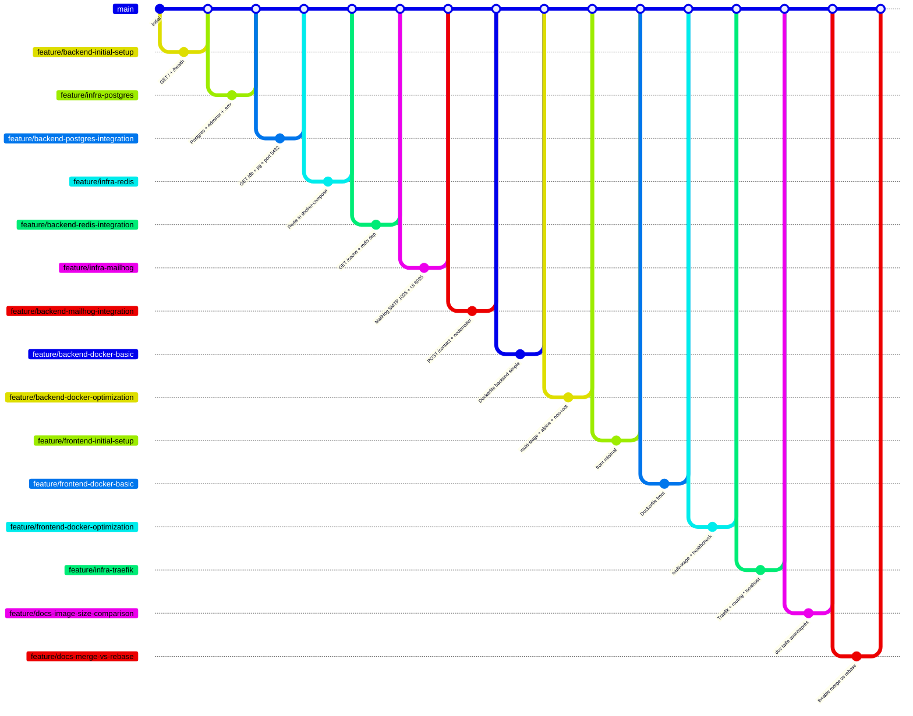

## 🗺️ Roadmap

```mermaid
gitGraph LR:
   commit id: "initial"

   branch feature/backend-initial-setup
   checkout feature/backend-initial-setup
   commit id: "GET / + /health"
   checkout main
   merge feature/backend-initial-setup

   branch feature/infra-postgres
   checkout feature/infra-postgres
   commit id: "Postgres + Adminer + .env"
   checkout main
   merge feature/infra-postgres

   branch feature/backend-postgres-integration
   checkout feature/backend-postgres-integration
   commit id: "GET /db + pg + port 5432"
   checkout main
   merge feature/backend-postgres-integration

   branch feature/infra-redis
   checkout feature/infra-redis
   commit id: "Redis in docker-compose"
   checkout main
   merge feature/infra-redis

   branch feature/backend-redis-integration
   checkout feature/backend-redis-integration
   commit id: "GET /cache + redis dep"
   checkout main
   merge feature/backend-redis-integration

   branch feature/infra-mailhog
   checkout feature/infra-mailhog
   commit id: "MailHog SMTP 1025 + UI 8025"
   checkout main
   merge feature/infra-mailhog

   branch feature/backend-mailhog-integration
   checkout feature/backend-mailhog-integration
   commit id: "POST /contact + nodemailer"
   checkout main
   merge feature/backend-mailhog-integration

   branch feature/backend-docker-basic
   checkout feature/backend-docker-basic
   commit id: "Dockerfile backend simple"
   checkout main
   merge feature/backend-docker-basic

   branch feature/backend-docker-optimization
   checkout feature/backend-docker-optimization
   commit id: "multi-stage + alpine + non-root"
   checkout main
   merge feature/backend-docker-optimization

   branch feature/frontend-initial-setup
   checkout feature/frontend-initial-setup
   commit id: "front minimal"
   checkout main
   merge feature/frontend-initial-setup

   branch feature/frontend-docker-basic
   checkout feature/frontend-docker-basic
   commit id: "Dockerfile front"
   checkout main
   merge feature/frontend-docker-basic

   branch feature/frontend-docker-optimization
   checkout feature/frontend-docker-optimization
   commit id: "multi-stage + healthcheck"
   checkout main
   merge feature/frontend-docker-optimization

   branch feature/infra-traefik
   checkout feature/infra-traefik
   commit id: "Traefik + routing *.localhost"
   checkout main
   merge feature/infra-traefik

   branch feature/docs-image-size-comparison
   checkout feature/docs-image-size-comparison
   commit id: "doc taille avant/après"
   checkout main
   merge feature/docs-image-size-comparison

   branch feature/docs-merge-vs-rebase
   checkout feature/docs-merge-vs-rebase
   commit id: "livrable merge vs rebase"
   checkout main
   merge feature/docs-merge-vs-rebase
```
