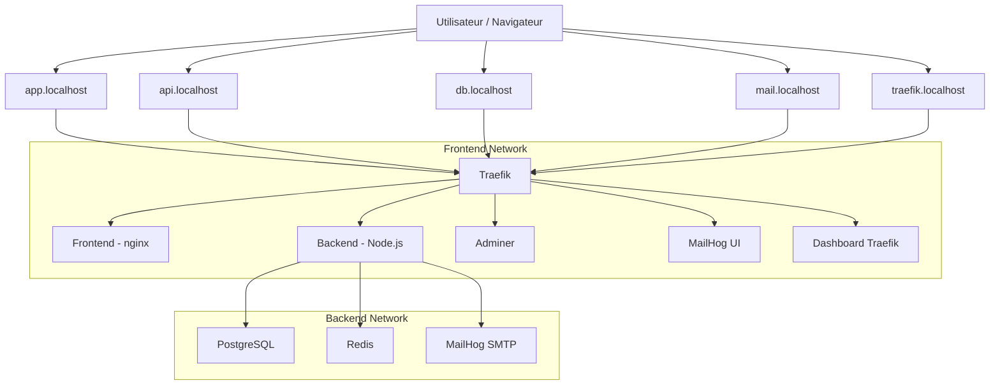

```mermaid
flowchart TD
    U[Utilisateur / Navigateur]
    U --> A[app.localhost]
    U --> B[api.localhost]
    U --> C[db.localhost]
    U --> D[mail.localhost]
    U --> E[traefik.localhost]
    A --> T[Traefik]
    B --> T
    C --> T
    D --> T
    E --> T
    T --> F[Frontend - nginx]
    T --> G[Backend - Node.js]
    T --> H[Adminer]
    T --> I[MailHog UI]
    T --> J[Dashboard Traefik]
    G --> K[PostgreSQL]
    G --> L[Redis]
    G --> M[MailHog SMTP]
    subgraph Frontend Network
        T
        F
        G
        H
        I
        J
    end
    subgraph Backend Network
        G
        K
        L
        M
    end
```
